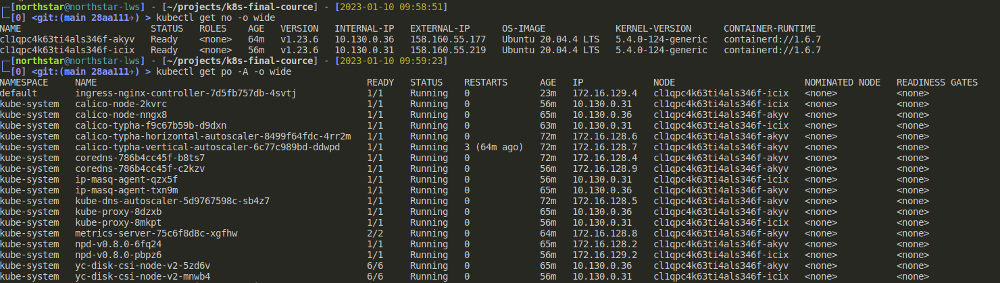
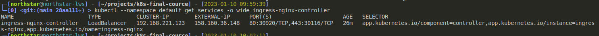

# Cluster deployment

Cluster was deployed on Yandex cloud platform, using [managed k8s](https://cloud.yandex.ru/docs/managed-kubernetes/) service

## Configuration

Master node region configuration:
 * ru-central1-a

 * ru-central1-b

 * ru-central1-c

| Key      | Value           |
|-------------------------|----------------|
| Kubernetes version      | 1.23           |
| Cluster CIDR            | 172.16.0.0/16  |
| Services CIDR           | 192.168.0.0/16 |
| Nodes mask (CIDR)       | 24             |
| Nodes per cluster limit | 128            |
| Pods per node limit     | 110            |
| Cluster public IPv4     | 51.250.70.4    |
| Cluster private IPv4    | 10.130.0.9     |

## Artifacts

