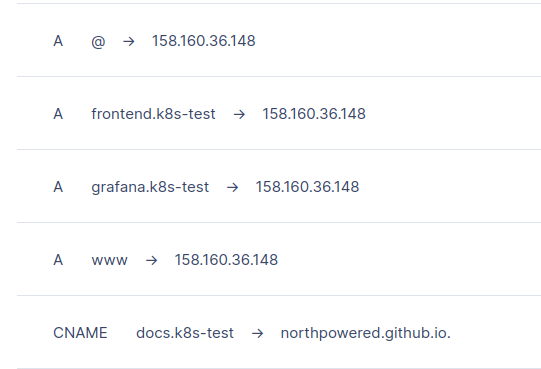
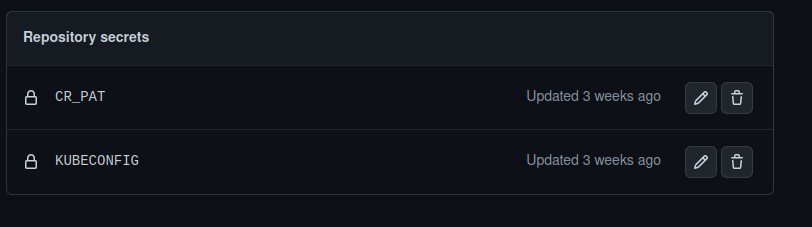

# Services deployment

## Ingress

Ingress controller was deployed with the helm chart
Local fork of the chart placed [here](https://github.com/northpowered/k8s-final-cource/tree/main/src/ingress/helm)

Ingress configuration:

```yaml
apiVersion: networking.k8s.io/v1
kind: Ingress
metadata:
  name: minimal-ingress
  annotations:
    kubernetes.io/ingress.class: "nginx"
    cert-manager.io/cluster-issuer: "letsencrypt"
    nginx.ingress.kubernetes.io/rewrite-target: /
spec:
  tls:
    - hosts:
      - frontend.k8s-test.northpowered.space
      - grafana.k8s-test.northpowered.space
      secretName: letsencrypt
  rules:
    - host: frontend.k8s-test.northpowered.space
      http:
        paths:
        - path: /
          pathType: Prefix
          backend:
            service:
              name: frontend
              port:
                number: 80
    - host: grafana.k8s-test.northpowered.space
      http:
        paths:
        - path: /
          pathType: Prefix
          backend:
            service:
              name: grafana
              port:
                number: 3000
```

## Artifacts

External ingress IPv4: 158.160.36.148

DNS config:



[Loadgenerator helm chart]([../../src/loadgenerator/helm/Chart.yaml](https://github.com/northpowered/k8s-final-cource/blob/main/src/loadgenerator/helm/Chart.yaml))

[CI/CD manifest]([../../.github/workflows/loadgenerator-cicd.yml](https://github.com/northpowered/k8s-final-cource/blob/main/.github/workflows/loadgenerator-cicd.yml))

KUBECONFIG secret:

